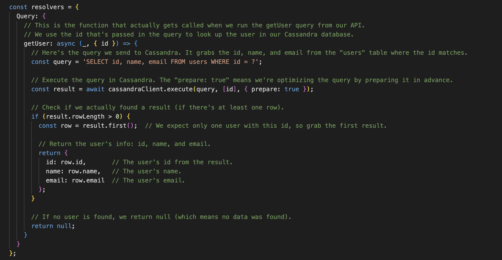
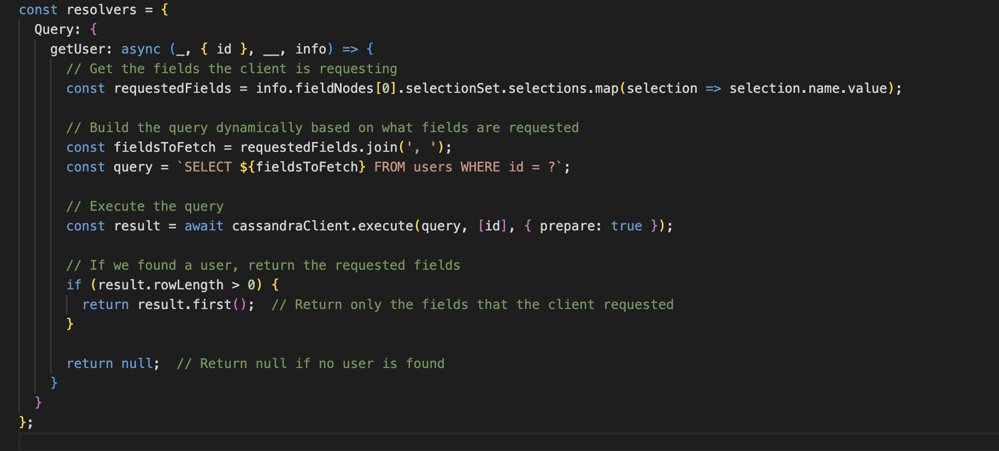

### Original Code Fetching All the Fields

In the original resolver, code was fetching all the fields (id, name, email) from the database, even if the client only asked for one field.

- Even when the client asked for only one field (e.g., just name), we would still fetch id, name, and email from the database.
  
- This results in over-fetching from the database, which can lead to wasted resources, especially in large applications where performance is critical.

### The Refactored Code (Fetching Only Requested Fields)

We refactored the code to dynamically build the query based on the fields that the client specifically requested. This way, only the necessary data is fetched from Cassandra, making the query more efficient.

- Dynamic Field Selection: The requestedFields array is generated based on the fields that the client asks for in the query.
- Optimized Query: Instead of hardcoding id, name, email in the query, we dynamically create the query string with only the requested fields, using fieldsToFetch.
- Efficient Data Retrieval: Now, the database only retrieves the fields that are requested, leading to less over-fetching.
 
